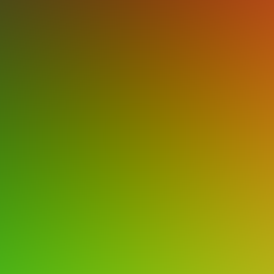
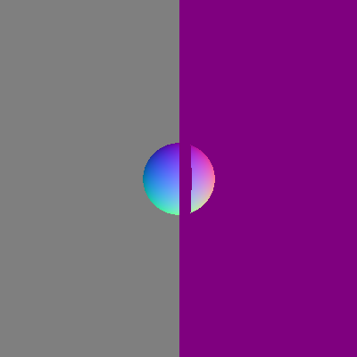

# CIS561_HW1

Generally the testing of normals looks all right, but the raycast, since there're 2 spheres in same position, I met the z fighting problem. 

The window does not produce anything at all. In fact, the rendered image are in the folder where you builded the project. 

There should be 2 images. One is the original normal test, which is "test.png"

The other is "raycast.png", which is the result of raycasting. 

I apologyse for writing most of the part in mainwindow.cpp again. Bad habit dies hard.
